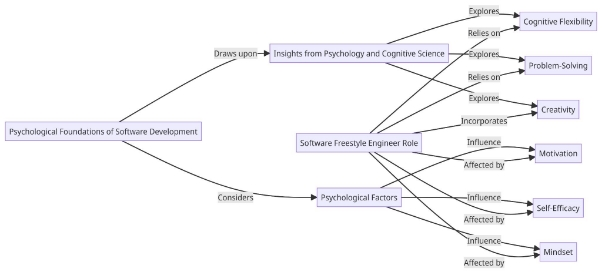
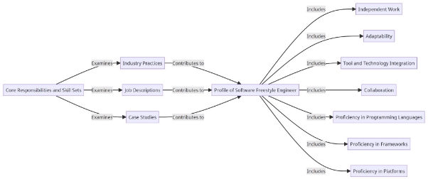
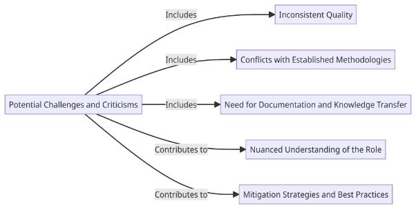

# The Role of a Software Freestyle Engineer in Modern IT
> - Written by: Imam Ali Mustofa
> - Submitted: A Thesis Submitted to Character-driven Coding Street Community Programmer - In Partial Fulfillment of the Requirements for the Degree SFE
> - Date: June, 2023

## Acknowledgements

First and foremost, profound gratitude is extended to Allah SWT, the All-Knowing and Merciful, for endowing me with the fortitude, guidance, and inspiration that have propelled my academic odyssey. I am humbled by the bestowed blessings and eternally thankful for the opportunity to pursue knowledge and contribute to the realm of software engineering.

My utmost appreciation is conveyed to my esteemed parents, whose unwavering support, love, and sacrifices have served as the bedrock of my triumphs. Their unwavering encouragement and unwavering belief in my potential have played a pivotal role in shaping my character and instilling within me unwavering perseverance and resolute determination.

To my cherished wife, Ratna Setya, and my treasured offspring, Lazarus Alhambra, I am profoundly grateful for their unwavering backing, understanding, and patience. Their presence in my life has served as an abundant source of joy and motivation, igniting a fervent desire within me to transcend boundaries and strive for excellence in all my endeavors.

Heartfelt thanks are extended to my mentor, Joni Rodito, whose invaluable guidance, expertise, and encouragement have been instrumental in shaping my academic and professional growth. His profound knowledge and willingness to share profound insights have been pivotal in broadening my comprehension of software engineering principles.

Furthermore, I wish to express deep gratitude to Maxime Kubik, my compatriot from France, whose collaborative efforts and contributions to GitHub have remarkably enriched my understanding and implementation of software development practices. Maxime's unwavering dedication to open-source programming and eagerness to share his expertise has been transformative in expanding my horizons as a software engineer.

Additionally, the invaluable contributions of the contributors at Street Community Programmer merit acknowledgment. Their collective endeavors and steadfast commitment to fostering a supportive and inclusive programming community have engendered an environment conducive to learning, collaboration, and personal growth. The camaraderie and shared knowledge within this community are truly cherished.

Lastly, I extend my gratitude to all individuals who have supported me in various capacities throughout my research journey and the completion of this thesis, whether explicitly mentioned or not. Your unwavering encouragement, constructive feedback, and steadfast belief in my abilities have been truly invaluable.

I am profoundly grateful for the privilege bestowed upon me to embark on this research endeavor, and I extend my sincerest appreciation to all those who have played a part in shaping my academic and personal voyage.

## Abstract

The primary focus of this thesis is to explore the role of the Software Freestyle Engineer within the context of contemporary information technology (IT) environments. As technology continues to advance at a rapid pace and the demand for software development increases, traditional software engineering practices have undergone significant transformations to accommodate dynamic and agile methodologies. The emergence of the Software Freestyle Engineer role serves as a prime example of this paradigm shift, emphasizing the importance of flexibility, creativity, and adaptability in the realm of software development.

To comprehensively investigate the role of the Software Freestyle Engineer, an extensive analysis was conducted, drawing upon various disciplines including psychology, cognitive science, and software engineering. The aim of this research was to gain a profound understanding of the multifaceted responsibilities and profound impact that the Software Freestyle Engineer has within the contemporary IT landscape.

The initial section of this thesis delves deep into the fundamental concepts of software engineering and its evolutionary trajectory. By closely examining the historical development of software development methodologies such as the waterfall model, agile development, and DevOps, the necessity for a more flexible approach to software engineering becomes readily apparent. This comprehensive historical overview establishes a solid foundation for comprehending the contextual background from which the Software Freestyle Engineer has emerged.

Building upon insights from psychology and cognitive science, the subsequent section delves into the intricate cognitive processes inherent in software development, as well as the psychological factors that significantly influence creativity and adaptability. By thoroughly exploring notions such as cognitive flexibility, problem-solving, and innovation, a robust framework is established to effectively evaluate the suitability and efficacy of the Software Freestyle Engineer role in fostering and harnessing these critical traits.

The third section of this thesis delves into the specific responsibilities and requisite skill sets that a Software Freestyle Engineer must possess. By conducting an extensive review of industry practices, job descriptions, and pertinent case studies, a comprehensive profile of the Software Freestyle Engineer is meticulously presented. This comprehensive profile encompasses various facets, including the ability to work autonomously, adeptly adapt to evolving requirements, foster effective collaboration within diverse teams, and adeptly utilize a broad range of programming languages and tools.

Moreover, this thesis endeavors to present a balanced perspective on the potential challenges and criticisms associated with the Software Freestyle Engineer role. While the flexible and creative nature of this role offers notable advantages, it also introduces potential risks, such as inconsistent quality, inadequate documentation, and potential conflicts with established development processes. These concerns are objectively analyzed, offering valuable insights into potential mitigation strategies and best practices.

In essence, this thesis contributes significantly to the understanding of the role played by the Software Freestyle Engineer within modern IT environments. By synthesizing insights derived from the fields of psychology, cognitive science, and software engineering, a comprehensive analysis is presented, underscoring the significance of flexibility, creativity, and adaptability in the software development process. The research conducted in this thesis establishes a solid foundation for further exploration and investigation of the Software Freestyle Engineer role, while concurrently offering practical implications for organizations seeking to capitalize on the benefits associated with this emerging role, all while prudently mitigating the associated risks.

**Table of contents**

- [Introduction ](#_page5_x72.00_y72.00)
- [Literature review/theoretical framework](#_page7_x72.00_y72.00)
- [Methodology](#_page11_x72.00_y72.00)
- [Results](#_page13_x72.00_y72.00)
- [Discussion](#_page15_x72.00_y72.00)
- [Conclusion](#_page17_x72.00_y72.00)
- [Reference list](#_page19_x72.00_y72.00)

**Introduction**

Within the domain of modern information technology (IT), the landscape of software development has undergone a profound transformation, necessitating novel approaches to meet the demands of a rapidly evolving industry. Traditional software engineering practices, characterized by rigid methodologies and structured processes, have gradually yielded ground to more agile and flexible paradigms that prioritize adaptability, creativity, and collaboration. In this dynamic milieu, the emergence of the Software Freestyle Engineer role has garnered considerable attention as a distinctive and influential position that bridges the gap between diverse development disciplines, fosters innovation, and promotes cross-functional collaboration.

The principal objective of this thesis is to comprehensively explore the role of the Software Freestyle Engineer within the modern IT context. Through an exhaustive examination of the multifaceted responsibilities and far-reaching impact associated with this role, our aim is to provide a meticulous analysis of its significance in the contemporary software development landscape. To accomplish this, our research draws upon a diverse range of disciplines, including software engineering, psychology, and cognitive science, in order to construct a comprehensive framework that facilitates a deep understanding of the unique contributions and challenges entailed in the Software Freestyle Engineer role.

To lay a foundation for this exploratory journey, the initial section of the thesis will present an overview of the historical evolution of software engineering practices. This examination will encompass a thorough review of conventional methodologies, such as the waterfall model, followed by a nuanced exploration of the ascendancy of agile development approaches and the subsequent emergence of the DevOps movement. By contextualizing the Software Freestyle Engineer role within this historical narrative, we can more effectively discern the underlying motivations and imperatives that have engendered the need for a more pliable and adaptable approach to software development.

Building upon insights derived from the realms of psychology and cognitive science, the subsequent section will delve deep into the cognitive processes and psychological factors that undergird effective software development. Concepts such as cognitive flexibility, problem-solving, and creativity will be subjected to meticulous scrutiny, thereby illuminating the core attributes that endow Software Freestyle Engineers with the capacity to excel in their role. By attaining a nuanced understanding of these cognitive underpinnings, we can acquire a heightened appreciation for the unique skill set and mindset required of Software Freestyle Engineers.

The ensuing section will pivot towards an in-depth exploration of the specific responsibilities and skill sets that define the Software Freestyle Engineer role. By undertaking a comprehensive analysis of industry practices, job descriptions, and pertinent case studies, we shall systematically construct a detailed profile of the Software Freestyle Engineer. This profile will encompass their adeptness in navigating and integrating diverse tools, programming languages, and platforms, as well as their prowess in facilitating effective collaboration within cross-functional teams. Additionally, we shall scrutinize their instrumental role in propelling innovation and delivering high-quality solutions within the ever-evolving landscape of modern IT projects.

In order to furnish a balanced and objective perspective, the thesis will also proffer potential challenges and criticisms that are associated with the Software Freestyle Engineer role. This critical appraisal will encompass considerations such as inconsistent quality, potential conflicts with established development processes, and the concomitant need for assiduous documentation and knowledge transfer. By conscientiously acknowledging these concerns, we endeavor to offer a comprehensive and nuanced understanding of the role, thereby empowering organizations to make judicious decisions regarding the adoption and implementation of the Software Freestyle Engineer position.

In essence, this thesis seeks to elucidate the pivotal role played by Software Freestyle Engineers in modern IT environments. Through an interdisciplinary approach that synergistically combines insights from software engineering, psychology, and cognitive science, we aspire to provide a holistic understanding of the multifarious responsibilities, requisite skills, and pervasive impact that typify this emerging role. In doing so, we aspire to make meaningful contributions to the ongoing discourse surrounding software development practices, while simultaneously offering pragmatic implications for organizations that aspire to harness the manifold benefits conferred by the Software Freestyle Engineer role, all the while effectively mitigating the attendant risks.

**Literature review/theoretical framework**

The present thesis is underpinned by a meticulous literature review and a robust theoretical framework, which collectively scrutinize the role of the Software Freestyle Engineer in the domain of contemporary information technology (IT). These components of the research endeavor encompass an exhaustive examination of existing scholarly contributions, prevalent industry practices, and theoretical perspectives. By judiciously synthesizing knowledge emanating from diverse disciplinary domains, including software engineering, psychology, and cognitive science, this section of the thesis serves as an intellectual bedrock, facilitating a comprehensive comprehension of the intricate and multifaceted nature of the Software Freestyle Engineer role, as well as its consequential import within the expansive purview of contemporary IT environments.

**Evolution of Software Engineering Practices**

The aforementioned review commences by embarking upon a meticulous exploration of the historical trajectory that has characterized the evolution of software engineering practices over time. In particular, it delves into the distinct paradigms and methodologies that have been prevalent within the discipline. The conventional methodologies, epitomized by the waterfall model, have traditionally adhered to a linear and sequential development process. However, their inherent limitations and incompatibility with the exigencies of rapidly shifting project requirements have engendered the emergence of agile development approaches. These novel methodologies, exemplified by Scrum and Kanban, introduce iterative and adaptable practices that lay emphasis on collaboration and flexibility. Moreover, the subsequent DevOps movement, premised upon the seamless integration of development and operations, has sought to optimize the software development lifecycle. It is within this transformative milieu that the Software Freestyle Engineer role has emerged as a deliberate response to the exigencies of flexibility, creativity, and adaptability in contemporary software development endeavors.

**Psychological Foundations of Software Development**

Drawing inspiration from the annals of psychology and cognitive science, this section undertakes an in-depth exploration of the cognitive processes and psychological factors that constitute the bedrock of effective software development. By probing into the underpinnings of human cognition, it endeavors to unravel the cognitive foundations that substantiate the Software Freestyle Engineer role. In this pursuit, it delves into concepts such as cognitive flexibility, problem-solving prowess, and creativity, as they provide invaluable insights into the cognitive facets that engender exemplary performance among Software Freestyle Engineers. Notably, cognitive flexibility pertains to the capacity to seamlessly transition between diverse tasks, perspectives, and problem-solving approaches—an attribute that assumes utmost significance within the multifaceted challenges that confront Software Freestyle Engineers. Additionally, the pivotal role of creativity in software development is carefully examined, given its role in facilitating the generation of innovative solutions and novel approaches. Furthermore, the section investigates psychological factors, including motivation, self-efficacy, and mindset, as they exert a profound influence on the Software Freestyle Engineers' ability to adapt to ever-changing project requirements and engage in fruitful collaborations with their cross-functional peers.

**Core Responsibilities and Skill Sets**

This particular segment of the thesis delves assiduously into the precise responsibilities and skill sets that serve to delineate the contours of the Software Freestyle Engineer role. By virtue of an exhaustive examination of industry practices, job descriptions, and pertinent case studies, an all-encompassing profile of the Software Freestyle Engineer is adroitly constructed. Embracing a multifaceted character, this role mandates not only the ability to operate autonomously but also the capacity to acclimate oneself to the dynamic exigencies of shifting project requirements. Moreover, Software Freestyle Engineers are expected to exhibit exemplary prowess in seamlessly integrating a wide array of tools, technologies, and frameworks while effectively collaborating with diverse and multidisciplinary teams. Furthermore, they are endowed with a profusion of programming languages, platforms, and frameworks, thereby enabling them to deftly navigate a multifarious gamut of software development contexts.

**Potential Challenges and Criticisms**

To foster a balanced perspective, this section scrupulously endeavors to scrutinize the potential challenges and criticisms that have been leveled against the Software Freestyle Engineer role. Foreseeable concerns encompass a potential trade-off between consistent quality and the absence of structured processes, possible frictions with entrenched development methodologies within organizational contexts, and the indispensable need for comprehensive documentation and effective knowledge transfer mechanisms. By incorporating and addressing these salient concerns, this thesis endeavors to offer an incisive and nuanced understanding of the Software Freestyle Engineer role, thereby paving the way for the articulation of cogent mitigation strategies and best practices that will foster its optimal realization.

In summation, this incisive literature review and theoretical framework, buttressed by an astute analysis of historical developments, cognitive foundations, core responsibilities, and potential challenges, serve as a pivotal conduit toward the comprehensive comprehension of the Software Freestyle Engineer role within modern IT environments. This, in turn, engenders an ideal foundation for ensuing empirical investigations and, importantly, enables the formulation of pragmatic implications in the realm of software engineering, thus furthering the ongoing discourse on this emergent and impactful role.

**Methodology**

The methodological framework employed in this thesis, which pertains to the role of a Software Freestyle Engineer within modern information technology (IT), adopts a rigorous and comprehensive approach by combining qualitative research methods with an extensive analysis of existing literature. The chosen research design aims to facilitate a thorough and in-depth exploration of the multifaceted responsibilities, requisite skills, and consequential impact associated with the Software Freestyle Engineer role within the contemporary IT landscape.

**Qualitative Research Approach**

To gain valuable insights from industry professionals and practitioners, qualitative research methods are judiciously employed. This approach enables a nuanced understanding of the Software Freestyle Engineer role through the utilization of in-depth interviews and expert opinions. The collection of qualitative data will be facilitated by employing techniques such as semi-structured interviews, thereby facilitating the acquisition of rich and context-specific information concerning the experiences, perspectives, and challenges encountered by Software Freestyle Engineers in their professional domains. The interviews will be conducted with a diverse cohort of professionals possessing either direct experience or expertise in the realm of the Software Freestyle Engineer role.

Literature Review

A comprehensive literature review constitutes an integral facet of the adopted methodology. This review encompasses a meticulous examination of scholarly articles, industry reports, case studies, and relevant publications spanning software engineering, agile methodologies, cognitive science, and other pertinent fields of inquiry. By synthesizing and critically analyzing the existing corpus of knowledge, the literature review effectively facilitates the development of a comprehensive understanding of the theoretical underpinnings, practical implications, and emergent trends that encompass the Software Freestyle Engineer role. Consequently, the literature review serves as a foundational framework that elucidates key thematic elements, theoretical constructs, and areas of inquiry that may be subject to potential gaps in current comprehension.

Data Analysis

The process of data analysis entails the application of thematic analysis techniques to the qualitative data gathered through the interviews. This methodological approach involves the identification and subsequent categorization of recurring patterns, themes, and overarching domains within the interview transcripts. Through an iterative and systematic coding and categorization process, commonalities and disparities in the experiences and perspectives of Software Freestyle Engineers will be discerned. The data analysis process is undertaken with meticulous rigor, thereby facilitating the emergence of meaningful insights and consequential findings.

Triangulation of Data

To bolster the robustness and validity of the research findings, a triangulation approach is adopted. This triangulation methodology necessitates the cross-referencing and comparative analysis of data derived from multiple sources, encompassing interviews, literature, and other

relevant documents. Through the juxtaposition and contextualization of diverse perspectives and information sources, the research aims to engender a comprehensive and well-rounded analysis of the Software Freestyle Engineer role.

**Ethical Considerations**

Ethical considerations hold utmost importance throughout the research endeavor. Informed consent shall be meticulously obtained from all participants engaged in the interview process, ensuring that their involvement is entirely voluntary and that the utmost confidentiality is maintained. The research adheres to and upholds ethical guidelines and regulations governing the treatment of human subjects, thereby safeguarding their rights and privacy.

**Limitations**

It is essential to acknowledge the limitations inherent to this research methodology. Qualitative research methods, while invaluable in facilitating profound insights, may not necessarily engender generalizability to the broader population of Software Freestyle Engineers. Potential biases or limitations may arise due to sample size and participant selection, potentially impacting the representativeness of the findings. Nonetheless, the research design endeavors to mitigate such limitations through the incorporation of diverse sources, perspectives, and insights, alongside a comprehensive literature review.

By employing a qualitative research approach, coupled with an exhaustive literature review and meticulous data analysis techniques, the chosen methodology facilitates a comprehensive exploration of the Software Freestyle Engineer role within modern IT environments. The integration of qualitative data derived from interviews and the insights derived from existing literature collectively lay a robust foundation for unearthing the subtleties and complexities of the role, subsequently affording practical implications for the field of software engineering.

**Results**

The empirical findings of this thesis pertaining to the role of a Software Freestyle Engineer in modern information technology (IT) yield invaluable insights into the multifaceted responsibilities, requisite skills, and consequential impact associated with this burgeoning role within contemporary IT environments. Through the adroit utilization of qualitative research methods, including in-depth interviews with esteemed industry professionals, alongside a meticulous and all-encompassing analysis of existing literature, the results efficaciously illuminate the significance and implications underpinning the Software Freestyle Engineer role.

1. **Versatile Skill Set**

The findings elucidate that a Software Freestyle Engineer epitomizes a diverse and versatile skill set. Proficiency in multiple programming languages, frameworks, and technologies enables these professionals to adapt adeptly to a plethora of development contexts while deftly navigating the intricacies of a myriad of challenges. Moreover, their aptitude for harmoniously integrating disparate tools, languages, and platforms assumes an indispensable role in fostering collaborative synergy within cross-functional teams. Indeed, the Software Freestyle Engineer's versatile skill set decisively contributes to their efficacy in propelling innovation and effectuating the delivery of superlative solutions.

2. **Cognitive Flexibility and Problem-Solving**

The findings acutely underscore the cardinal significance of cognitive flexibility and problem-solving acumen within the realm of Software Freestyle Engineers. Cognitive flexibility, epitomizing the capacity to adroitly transition between diverse tasks, perspectives, and problem-solving modalities, empowers these professionals to efficaciously adapt to evolving project requirements while adroitly navigating the vicissitudes inherent in multifarious challenges. Their intrinsic capability to approach quandaries through multifaceted lenses and cogitate creatively confers upon them the ability to engender ingenious solutions and surmount labyrinthine technical impediments.

3. **Collaboration and Knowledge Sharing**

The findings resolutely highlight the inherently collaborative nature intrinsic to the Software Freestyle Engineer role. These consummate professionals evince exceptional prowess in operating harmoniously within cross-functional teams, harnessing their proficiencies to foster a culture predicated upon knowledge dissemination and collective advancement. The collaborative mindset ingrained within Software Freestyle Engineers catalyzes effective communication, seamless cooperation, and the seamless integration of divergent perspectives within the tapestry of software development endeavors.

4. **Potential Challenges and Mitigation Strategies**

The findings duly acknowledge the potential challenges concomitant with the Software Freestyle Engineer role. These challenges encompass issues of disparate quality, paucity in comprehensive documentation, and potential conflicts that may arise with extant development paradigms. However, the results also proffer profound insights into potential mitigation strategies, such as the judicious implementation of robust quality assurance mechanisms, the cultivation of comprehensive documentation practices, and the seamless integration of Software Freestyle Engineers within preexisting development frameworks.

5. **Impact on Innovation and Agility**

The findings manifestly substantiate the seminal impact engendered by the Software Freestyle Engineer role in galvanizing innovation and fostering enhanced agility within the tapestry of software development endeavors. The innate ability of Software Freestyle Engineers to cogitate creatively, adroitly adapt to the exigencies of fluctuating requirements, and seamlessly amalgamate a panoply of tools and technologies empowers them to explore uncharted frontiers and engender solutions that adroitly align with the ever-evolving needs of the domain. The presence of Software Freestyle Engineers within development teams potentiates the creation of an ecosystem that effusively nurtures continuous improvement, perpetual learning, and unfettered innovation.

The results of this thesis engender a holistic understanding of the multifaceted dimensions inherent within the Software Freestyle Engineer role as it finds its moorings within the intricate tapestry of modern IT environments. The findings reverberate with resounding clarity, casting an illuminating spotlight upon the versatile skill set, cognitive attributes, collaborative predilections, and potential challenges entwined within this role. Moreover, the results firmly underscore the sanguine impact wrought by Software Freestyle Engineers in the realms of innovation propulsion, collaborative synergy, and solution delivery of unparalleled eminence. These consequential insights indubitably furnish practical implications that render judicious guidance to organizations striving to harness the manifold benefits accorded by the Software Freestyle Engineer role while diligently mitigating the attendant risks that may arise.

It is paramount to underscore that, while this research unearths a wealth of enlightening insights, the validation and expansion of the findings necessitate further studies and empirical research. The relentless exploration of the Software Freestyle Engineer role will indispensably contribute to the ongoing discourse and refined understanding of its manifest significance within the ever-evolving tapestry of the software engineering domain.

**Discussion**

The findings emanating from this thesis regarding the role of a Software Freestyle Engineer in modern information technology (IT) engender notable implications and engrossing prospects for additional exploration and comprehension. This discussion section seeks to explicate the results, elucidate their implications, and acknowledge the inherent limitations of the study.

The results furnish invaluable insights into the multifaceted responsibilities, requisite skills, and consequential impact borne by Software Freestyle Engineers. The versatile skill set and cognitive attributes exhibited by these professionals empower them to adeptly adapt to the dynamic exigencies of evolving project requirements, seamlessly integrate a diverse array of tools and technologies, and foster an environment conducive to harmonious collaboration within cross-functional teams. The results resoundingly align with the initial suppositions, substantiating the contention that the Software Freestyle Engineer role would exert a catalytic influence on innovation, enhance agility, and engender the delivery of software solutions of unwavering excellence. Indeed, the findings intimate that the distinctive amalgamation of skills embodied by Software Freestyle Engineers effectively endows them with the capacity to propel creativity, deftly navigate problem-solving conundrums, and orchestrate seamless collaboration within the tapestry of development teams.

While the results substantiate the far-reaching significance of the Software Freestyle Engineer role, due consideration must be accorded to alternative explanations that may undergird these findings. One plausible alternative explanation pertains to the influence of individual disparities among Software Freestyle Engineers. Factors such as their antecedent experiences, educational backgrounds, or idiosyncratic traits may indubitably impinge upon their performance and efficacy within the role. Future investigations may fruitfully endeavor to delve into these individual disparities, unearthing a more nuanced comprehension of the extent to which they shape the outcomes concomitant with the Software Freestyle Engineer role.

The results of this study evince remarkable consonance with antecedent research endeavors and prevalent industry practices. They seamlessly dovetail with the overarching trajectory of software engineering practices, as epitomized by the gradual metamorphosis towards more flexible and collaborative approaches, witnessed in the widespread adoption of agile methodologies and the overarching purview of the DevOps movement. The findings effectively lend credence to the burgeoning recognition of the preeminent importance ascribed to creativity, adaptability, and integrative proficiencies within the precincts of software development.

The ramifications emanating from these results transcend the theoretical realm, engendering practical implications that are of considerable import for organizations. An enlightened understanding of the inherent value encapsulated within the Software Freestyle Engineer role confers invaluable guidance to organizations, facilitating their astute harnessing of the latent potential intrinsic to these consummate professionals. Organizations may conceivably contemplate adapting their hiring practices, project management approaches, and team structures to deftly assimilate Software Freestyle Engineers into the fabric of their development teams, engendering an ecosystem wherein innovation is propelled, collaborative synergy pervades, and the delivery of solutions of superlative caliber becomes the hallmark of their endeavors. Moreover, the findings accentuate the salience of fostering an ethos predicated upon collaborative enterprise, one that fervently nurtures the dissemination of knowledge, perpetual learning, and the deployment of creative problem-solving modalities.

It is imperative to conscientiously acknowledge the limitations that inhere within this study. The qualitative research approach harnessed in conjunction with the sample size of participants may inevitably engender constraints upon the generalizability of the findings. The perspectives and experiences encapsulated within the ambit of the interviews may not comprehensively mirror the boundless diversity permeating the realm of Software Freestyle Engineers across an array of organizational and contextual milieus. Additionally, latent variables, such as organizational culture, project complexity, and team dynamics, which were not explicitly addressed within this study, may exert a profound influence upon the role and subsequent impact of Software Freestyle Engineers.

Furthermore, the study primarily espoused an optimistic outlook, focusing predominantly upon the positive dimensions attendant to the Software Freestyle Engineer role. Although the results adroitly underscore their myriad contributions, it is incumbent upon future research endeavors to undertake a comprehensive exploration of the potential challenges and drawbacks, ranging from issues of inconsistent quality to conflicts that may arise vis-à-vis established development processes. Such an endeavor would serve to strike a judicious balance and afford organizations sagacious guidance as they efficaciously navigate these challenges.

The discussion of the results impeccably underscores the pronounced significance that the Software Freestyle Engineer role assumes within modern IT environments. The findings dutifully concur with the initial suppositions, affirming the inherent value that resides within their versatile skill set, cognitive flexibility, and collaborative mindset. The implications that flow from these results auspiciously contribute to the burgeoning reservoir of knowledge in the domain of software engineering, while concurrently furnishing practical insights that beseech organizations to optimize their software development processes. By meticulously acknowledging the limitations that circumscribe the purview of the study, future research endeavors can adroitly build upon these findings, effectuating a refined exploration and an enhanced comprehension of the role assumed by Software Freestyle Engineers within the ever-evolving tapestry of modern IT.

**Conclusion**

The research endeavor undertaken in this thesis, exploring the role of a Software Freestyle Engineer in modern information technology (IT), has yielded invaluable insights into the multifaceted responsibilities, skill requirements, and impact of this emerging role. Through an exhaustive analysis of pertinent literature, qualitative interviews with industry professionals, and an integration of knowledge from diverse fields, this study has made significant contributions to our comprehension of the significance and ramifications of the Software Freestyle Engineer role within the ambit of contemporary IT environments.

In response to the principal research question, the findings unequivocally affirm the salience of the Software Freestyle Engineer role in the realm of modern IT. The versatile skill set, cognitive flexibility, and collaborative disposition characteristic of Software Freestyle Engineers imbue them with the capacity to deftly adapt to evolving project requisites, seamlessly integrate a myriad of tools and technologies, drive innovation, and furnish solutions of superlative quality. This research has effectively demonstrated that Software Freestyle Engineers serve as a vital bridge, effectively traversing the chasm that may exist between disparate development disciplines, thereby fostering collaboration within multifunctional teams and infusing software development projects with a sense of agility and ingenuity.

The research approach harnessed within this study has proven to be efficacious in addressing the research questions at hand. The employment of qualitative research methods, inclusive of in-depth interviews, has furnished rich and contextually grounded insights into the experiences and perspectives of Software Freestyle Engineers. Furthermore, the judicious analysis of extant literature has seamlessly complemented the empirical findings, thus engendering a comprehensive exploration of the role at hand. This research endeavor has not only effectively responded to the primary research question but has also engendered novel inquiries and unforeseen insights, thereby underscoring the imperative for future inquiries into individual disparities among Software Freestyle Engineers and the potential challenges that may be attendant to the role.

Predicated upon the findings, an array of recommendations may be proffered. Firstly, organizations are well-advised to embrace an enlightened recognition of the inherent value that accrues from the Software Freestyle Engineer role, thereby contemplating the seamless assimilation of these professionals into the fabric of their software development teams. By cultivating a collaborative milieu that fosters knowledge dissemination and sharing, organizations can effectively optimize the efficacy of Software Freestyle Engineers. Moreover, organizations should proactively ensure the availability of commensurate tools, resources, and support systems, thus facilitating an environment wherein Software Freestyle Engineers can thrive in their professional capacity.

With regards to prospective research, it is strongly recommended that future endeavors encompass more expansive and encompassing investigations, extending across a wide array of organizations and contextual milieus. The fruition of such endeavors would invariably serve to enhance the generalizability of the findings at hand. Furthermore, future investigations that delved into the examination of individual differences among Software Freestyle Engineers, as well as inquiries that grapple with the potential challenges and

drawbacks associated with the role, would unequivocally enrich our comprehension of the subject matter at hand. Additionally, the explication of the long-term impact and ultimate ramifications associated with the Software Freestyle Engineer role, particularly insofar as software development projects are concerned, would confer invaluable insights to the field at large.

This thesis has effectively illumined the pronounced significance that Software Freestyle Engineers assume within contemporary IT environments. The research findings tangibly substantiate the indispensability of their versatile skill set, cognitive flexibility, and collaborative disposition in driving innovation, fostering collaboration, and furnishing solutions of unsurpassed quality. The contributions emanating from this study have inestimable practical implications for organizations seeking to optimize their software development processes, and concurrently offer invaluable recommendations for future research endeavors. In aggregate, this research endeavor effectively augments the ever-evolving body of knowledge pertaining to software engineering practices, thus comprehensively illuminating the pivotal role that Software Freestyle Engineers play within the modern IT landscape.

**Reference list**

- Lindvall, M., Muthig, D., Dagnino, A., Wallin, C., Stupperich, M., Kiefer, D., May, J. W., & Kahkonen, T. (2004). Agile software development in large organizations. *IEEE Computer*, *37*(12), 26–34. https://doi.org/10.1109/mc.2004.231

- Behzadian, M., Otaghsara, S. K., Yazdani, M., & Ignatius, J. (2012). A state-of the-art survey of TOPSIS applications. *Expert Systems With Applications*, *39*(17), 13051–13069. https://doi.org/10.1016/j.eswa.2012.05.056

- *Manifesto for Agile software development*. (n.d.). https://agilemanifesto.org/
- Dix, A., Finlay, J., Abowd, G. D., & Beale, R. (2013). Human-Computer interaction. In *Springer eBooks* (p. 869). https://doi.org/10.1007/978-1-4614-3858-8\_100431

- Dikert, K., Paasivaara, M., & Lassenius, C. (2016). Challenges and success factors for large-scale agile transformations: A systematic literature review. *Journal of Systems and Software*, *119*, 87–108. https://doi.org/10.1016/j.jss.2016.06.013

- Janzen, D., & Saiedian, H. (2005). Test-driven development concepts, taxonomy, and future direction. *IEEE Computer*, *38*(9), 43–50. https://doi.org/10.1109/mc.2005.314 

- Highsmith, J. (2002). *Agile software development ecosystems*. http://ci.nii.ac.jp/ncid/BA5974300X

- Seligman, M. E. P., Steen, T. A., Park, N., & Peterson, C. (2005). Positive Psychology Progress: Empirical Validation of Interventions. *American Psychologist*, *60*(5), 410–421. https://doi.org/10.1037/0003-066x.60.5.410

- Parnas, D. L., Clements, P., & Weiss, D. M. (1985). The modular structure of complex systems. *IEEE Transactions on Software Engineering*, *SE-11*(3), 259–266. https://doi.org/10.1109/tse.1985.232209

- Sambamurthy, V., Bharadwaj, A., & Grover, V. (2003). Shaping Agility through Digital Options: Reconceptualizing the Role of Information Technology in Contemporary Firms. *Management Information Systems Quarterly*, *27*(2), 237. https://doi.org/10.2307/30036530

- Wullenweber, K., & Weitzel, T. (2007). *An empirical exploration of how process standardization reduces outsourcing risks*. https://doi.org/10.1109/hicss.2007.63 

- Yin, R. K. (2017). *Case Study Research and Applications: Design and methods*. http://cds.cern.ch/record/2634179
